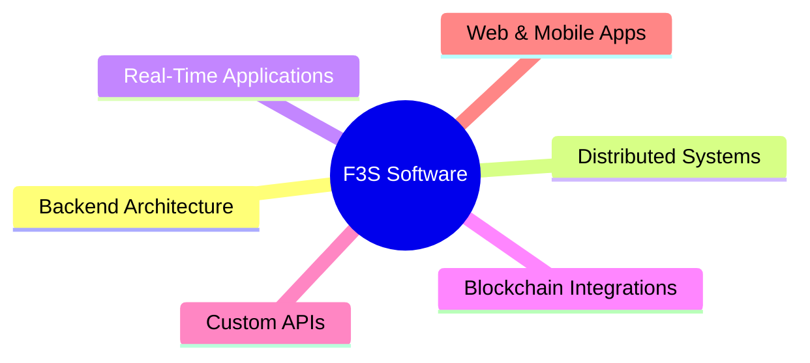

# Felipe Sampaio

<div align="center">

# 👨‍💻 Felipe Sampaio

### Backend-Focused Senior Software Engineer

**Node.js • NestJS • Java • Distributed Systems • Web3 • C++ • Game Development**


<br/>

<a href="https://github.com/f3sampaio">
  
</a>

<a href="https://github.com/f3sampaio?tab=repositories">
  
</a>

<a href="https://www.linkedin.com/in/felipe-sampaio-marques-18739a109">
  
</a>

<a href="https://www.f3ssoftware.com">
  
</a>

</div>

---

# 🚀 About Me

I'm a Senior Software Engineer with **8+ years of experience** building scalable APIs, distributed systems, and real-time applications.

My primary focus is backend engineering using **Node.js (NestJS)** and **Java (Spring)**, with experience across:

- Banking systems
- Healthcare platforms
- Fintech solutions
- Real-time communication systems
- Blockchain-integrated applications

Alongside backend engineering, I am currently studying:

- **C++ for systems and performance-oriented programming**
- **Game development with Unreal Engine and Unity**
- **Game architecture and gameplay systems**
- **Data structures and algorithms**

I enjoy solving engineering problems related to:

```txt
Scalability • Distributed Systems • Performance • Architecture • High Throughput
```

Currently exploring the intersection between:

```txt
Backend Engineering × Web3 × Real-Time Infrastructure × C++ × Game Development
```

---

# 🏢 Founder — F3S Software

<div align="center">

### 🌍 https://www.f3ssoftware.com

</div>

Founder of **F3S Software**, a software engineering company focused on building scalable and reliable digital products.

## Core Services



---

# ⚙️ Technical Stack

<div align="center">

| Backend | Frontend | Infrastructure | Systems |
|---|---|---|---|
| Node.js | React | AWS | Distributed Systems |
| NestJS | Angular | Docker | WebRTC |
| Java | React Native | GitHub Actions | Blockchain Integration |
| Spring Boot | TypeScript | Linux | Software Architecture |
| Express.js | Unity | CI/CD | Event-Driven Systems |
| C++ (Learning) | HTML/CSS | Git | High-Performance Systems |

</div>

---

# 🧠 Engineering Interests

```txt
✔ Backend Scalability
✔ Distributed Architectures
✔ Event-Driven Systems
✔ High-Throughput Infrastructure
✔ Real-Time Communication
✔ Ethereum Payment Monitoring
✔ Web3 Commerce Models
✔ C++ Systems Programming
✔ Game Development
✔ Software Architecture
```

---

# 🎮 Current Learning Journey

```cpp
class CurrentFocus {
public:
    vector<string> studying = {
        "C++",
        "Data Structures & Algorithms",
        "System Design",
        "Game Development",
        "Unreal Engine",
        "Unity",
        "Game Architecture",
        "Performance Optimization"
    };
};
```

---

# 📈 GitHub Analytics

<div align="center">


</div>

---

# 🔥 Contribution Activity

<div align="center">


</div>

---

# 🛠 Current Focus

```yaml
backend:
  - High-throughput architectures
  - Scalable API design
  - Distributed systems
  - Event-driven applications

web3:
  - Ethereum payment infrastructure
  - ERC-20 monitoring
  - Blockchain commerce models

gamedev:
  - Unreal Engine
  - Unity
  - Gameplay systems
  - Game architecture
  - C++ programming
```

---

# 📚 Currently Studying

<div align="center">


</div>

---

# 🌎 Connect With Me

<div align="center">

<a href="mailto:fmarques899@gmail.com">
  
</a>

<a href="https://www.linkedin.com/in/YOUR_LINKEDIN">
  
</a>

<a href="https://www.f3ssoftware.com">
  
</a>

</div>

---

<div align="center">

### 💡 Engineering scalable systems while exploring game technology.

</div>
