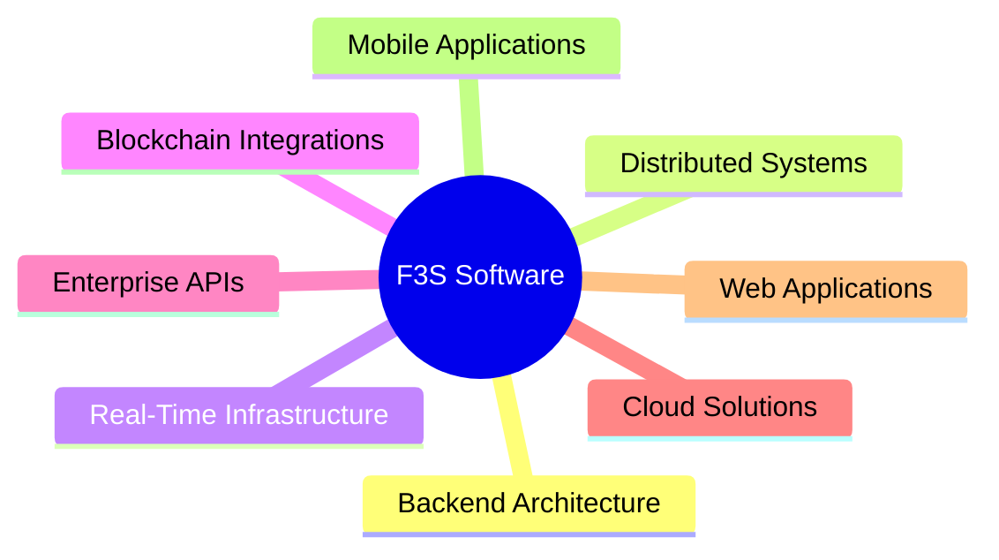

# Felipe Sampaio

<div align="center">

# 👨‍💻 Felipe Sampaio

### Senior Software Engineer • Backend Architect • Distributed Systems Engineer

**Node.js • NestJS • Java • Cloud Architecture • Web3 • C++ • Systems Engineering**


<br/>

<a href="https://github.com/f3sampaio">
  
</a>

<a href="https://github.com/f3sampaio?tab=repositories">
  
</a>

<a href="https://www.linkedin.com/in/felipe-sampaio-marques-18739a109">
  
</a>

<a href="https://www.f3ssoftware.com">
  
</a>

</div>

---

# 🚀 About Me

Senior Software Engineer with **8+ years of experience** designing, developing, and scaling backend platforms, distributed systems, and real-time applications.

My experience spans enterprise-grade environments across:

- Banking
- Healthcare
- Fintech
- Real-time communication platforms
- Blockchain-integrated systems

I specialize in backend engineering with strong expertise in:

- **Node.js / NestJS**
- **Java / Spring Boot**
- **Distributed architectures**
- **Scalable REST APIs**
- **Cloud-native systems**
- **Real-time infrastructure**
- **Blockchain integrations**

Alongside enterprise software engineering, I am currently expanding my expertise into:

- **C++ systems programming**
- **Cybersecurity fundamentals**
- **Game technology and engine architecture**
- **Performance-oriented software engineering**
- **Low-level systems concepts**

---

# 🏢 Founder — F3S Software

<div align="center">

### 🌍 https://www.f3ssoftware.com

</div>

Founder of **F3S Software**, a software engineering company focused on building scalable, maintainable, and production-grade digital solutions.

## Core Areas



---

# ⚙️ Technical Expertise

<div align="center">

| Backend Engineering | Frontend | Infrastructure | Systems Engineering |
|---|---|---|---|
| Node.js | React | AWS | Distributed Systems |
| NestJS | Angular | Docker | Event-Driven Architecture |
| Java | React Native | Linux | WebRTC |
| Spring Boot | TypeScript | GitHub Actions | Software Architecture |
| Express.js | Unity | CI/CD Pipelines | Blockchain Integration |
| C++ (Learning) | HTML/CSS | Git | High-Performance Systems |

</div>

---

# 🧠 Engineering Focus

```txt
✔ Scalable Backend Architectures
✔ Distributed Systems Design
✔ High-Throughput Infrastructure
✔ Event-Driven Applications
✔ Real-Time Communication Systems
✔ Cloud-Native Engineering
✔ Blockchain Payment Infrastructure
✔ Web3 Commerce Models
✔ Systems Programming with C++
✔ Cybersecurity Fundamentals
✔ Software Performance Optimization
✔ Game Technology & Engine Architecture
```

---

# 🔬 Current Technical Exploration

```cpp
class EngineeringFocus {
public:
    vector<string> currentTopics = {
        "C++ Systems Programming",
        "Cybersecurity Fundamentals",
        "Linux Internals",
        "Network Architecture",
        "Performance Optimization",
        "Game Engine Architecture",
        "Real-Time Systems",
        "Engine-Level Programming"
    };
};
```

---

# 📈 GitHub Analytics

<div align="center">


</div>

---

# 🔥 Contribution Activity

<div align="center">


</div>

---

# 🛠 Current Focus

```yaml
backend_engineering:
  - Scalable API ecosystems
  - Distributed systems
  - Event-driven applications
  - High-throughput infrastructure

cloud_and_web3:
  - Ethereum payment infrastructure
  - ERC-20 monitoring systems
  - Blockchain commerce integrations
  - Cloud-native applications

systems_and_security:
  - C++ systems programming
  - Linux ecosystem
  - Cybersecurity fundamentals
  - Performance-oriented engineering

game_technology:
  - Unreal Engine architecture
  - Unity development
  - Gameplay systems
  - Engine-level experimentation
```

---

# 📚 Currently Expanding Expertise

<div align="center">


</div>

---

# 🌎 Connect With Me

<div align="center">

<a href="mailto:fmarques899@gmail.com">
  
</a>

<a href="https://www.linkedin.com/in/felipe-sampaio-marques-18739a109">
  
</a>

<a href="https://www.f3ssoftware.com">
  
</a>

</div>

---

<div align="center">

### 💡 Engineering scalable systems while exploring low-level technologies, cybersecurity, and interactive systems.

</div>
